<p align="center">
  
</p>

# SMKN 24 Jakarta

Website publik dan dashboard admin SMK Negeri 24 Jakarta. Repository ini menggunakan dua aplikasi Next.js:

- `apps/main-web`: website utama publik.
- `apps/admin`: dashboard administrasi yang mengakses API `main-web`.

## Prasyarat

Pastikan perangkat sudah memiliki Git, Node.js 20 atau lebih baru, npm, dan akun GitHub jika ingin melakukan push ke repository publik.

Periksa instalasi:

```bash
node --version
npm --version
git --version
```

## Instalasi

Clone repository, lalu masuk ke folder proyek:

```bash
git clone https://github.com/USERNAME/NAMA-REPOSITORY.git
cd NAMA-REPOSITORY
```

Instal dependensi website utama:

```bash
cd apps/main-web
npm install
```

Instal dependensi dashboard admin dari folder root proyek:

```bash
cd ../admin
npm install
```

Tidak perlu menjalankan `npm install` dari root karena file `package.json` berada di masing-masing aplikasi.

## Environment Variable

Dashboard admin memerlukan URL website utama. Dari folder `apps/admin`, salin file contoh.

Windows PowerShell:

```powershell
Copy-Item .env.example .env.local
```

macOS/Linux:

```bash
cp .env.example .env.local
```

Isi `apps/admin/.env.local`:

```env
NEXT_PUBLIC_MAIN_WEB_URL=http://localhost:3000
```

Jangan commit file `.env.local`, token, password, atau secret ke repository publik. File environment lokal sudah diatur dalam `.gitignore`.

## Menjalankan Saat Development

### Website utama

Dari folder `apps/main-web`:

```bash
npm run dev
```

Buka [http://localhost:3000](http://localhost:3000).

### Dashboard admin

Karena port `3000` digunakan website utama, jalankan dashboard admin pada port `3001`. Dari folder `apps/admin`:

```bash
npm run dev -- -p 3001
```

Buka [http://localhost:3001](http://localhost:3001).

Jalankan kedua aplikasi secara bersamaan jika ingin menguji alur admin yang terhubung ke API website utama.

## Perintah yang Tersedia

Jalankan perintah dari folder aplikasi terkait:

```bash
npm run dev      # server development
npm run lint     # pemeriksaan kode
npm run build    # build production
npm run start    # menjalankan hasil build production
```

Contoh pemeriksaan sebelum deploy:

```bash
cd apps/main-web
npm run lint
npm run build
```

## Struktur Direktori

```text
.
├── apps/
│   ├── main-web/    # Website publik dan API
│   └── admin/       # Dashboard admin
├── packages/shared/ # Tipe yang digunakan bersama
├── .assets/         # Aset dokumentasi/proyek
└── README.md
```

## Push Manual ke GitHub Public Repository

Pastikan file rahasia dan hasil build tidak ikut ter-upload. Periksa terlebih dahulu:

```bash
git status --short
git diff -- .gitignore README.md
```

Jika repository GitHub masih kosong, jalankan dari folder root proyek:

```bash
git init
git branch -M main
git remote add origin https://github.com/USERNAME/NAMA-REPOSITORY.git
git add .
git status
git commit -m "Initial project setup"
git push -u origin main
```

Jika repository lokal sudah terhubung ke GitHub:

```bash
git add .
git status
git commit -m "Update project"
git push origin main
```

Ganti `USERNAME/NAMA-REPOSITORY` dengan alamat repository GitHubmu. Sebelum menjalankan `git add .`, pastikan tidak ada `.env.local`, password, API key, atau credential lain yang muncul pada `git status`.
jika anda belum memiliki git, cek di [Periksa-instalasi]("Periksa Instalasi")

## Deploy

Repository publik hanya menyimpan source code dan konfigurasi yang aman. Untuk deploy aplikasi Next.js, gunakan platform yang mendukung Next.js seperti Vercel atau server Node.js. Atur environment variable deployment melalui pengaturan platform tersebut, bukan dengan menulis secret ke source code.
